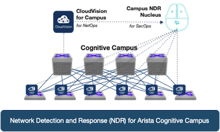
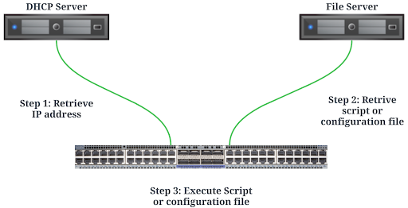

 

# Arista September Southwest Region Newsletter

Welcome to the September 2024 newsletter for Arista customers in the U.S. Southwest Region!
 
We welcome your feedback on the newsletter. If you have any ideas on what you want to see, please reach out to southwest@arista.com.

---

## **Distributed Network Detection and Response(NDR) in the Enterprise Network**
By: Salman Zahid, Sr. Systems Engineer Manager, Southwest Region

Zero Trust Networking (ZTN) is a top priority for many CIOs and CISOs due to the increasing complexity of networks and applications, which expands the attack surface and raises security concerns. To address these risks, a series of strategic architectural measures are essential. These include deploying a strong Network Admission Control (NAC), establishing identity-aware microperimeters, and maintaining continuous monitoring with tools such as Network Detection and Response (NDR). 

Implementing a solution like Network Detection and Response (NDR) requires access to traffic across various segments of the network. While this is relatively straightforward in a datacenter with a centralized tap aggregation network, replicating this setup in an enterprise LAN that connects users and devices can be challenging. Installing sensors in every Intermediate Distribution Frame (IDF) can be operationally complex, and creating a distributed packet capture network, though feasible, introduces both commercial and technical difficulties, increasing overall complexity. As a result, many enterprises may be daunted by these challenges and continue to operate with an assumed level of risk due to the lack of continuous monitoring recommended by Zero Trust Networking principles. 

Arista has introduced an innovative solution to address this challenge by deploying an NDR agent directly on the campus edge switches. As user and device traffic flows through these switches, they not only handle standard L2/L3 forwarding but also function as NDR sensors. These switches can inspect the traffic, perform detailed Deep Packet Inspection (DPI) analysis, and send summarized reports from each switch-based sensor to the backend analytics engine, Nucleus. The Nucleus analytics engine can be hosted either in the public cloud or on-premises via a Campus Nucleus. 

The distributed NDR sensor architecture within and Arista Campus design is depicted below.  

<figure markdown>

    <figcaption>  </figcaption>
</figure> 

This elegant architecture allows customers to enable continuous security monitoring in the enterprise without introducing any new hardware than what they would already have for providing connectivity to users and devices within the enterprise network.

Here are the functions of Arista distributed switch based sensor.

**Profile: Know what's on your network**  

- Discover, profile, and track devices, users and applications using AI-based fingerprinting

**Detect: Find bad behavior**

- Detect sophisticated threats with the lowest noise possible
- Find indicators of compreomise 

To learn more about Arista’s unique and novel approach to enabling NDR in a distributed enterprise network, please visit

Links for additional information:  
[Arista NDR Campus Datasheet](https://www.arista.com/assets/data/pdf/Datasheets/Arista-NDR-Campus-Datasheet.pdf)  

---

## **Arista Zero Touch Provisioning: "From Zero to Hero, in 20 minutes"** 
By: Alex Bojko, Advanced Services Engineer Southwest Region

Arista ZTP (Zero Touch Provisioning) is a day 0 feature to help you get your network up and running with minimal user intervention. There are a handful of frustrating pain points that come along with deploying new network switches. From sitting at your desk with the new switch plugged in and powered up, creating an ear piercing humming while you attempt to push initial configuration onto the device over CLI. Or standing in a data center, having just racked and cabled the device up, attempting to console in and push new configuration onto the device. Neither of these scenarios are fun, and both can be completely avoided thanks to Arista ZTP.  

ZTP is a process within EOS that is enabled by default on every Arista switch. When the device boots up, and no startup-config file is found, the switch will boot into "ZTP mode". When in ZTP mode, the switch will put any active port (ethernet or management interface) into the "no switchport" state and attempt to reach out and connect to a DHCP server. If no DHCP server is found, the switch will keep attempting to locate one, and the device will remain in a non-fully-functional state. At this point, you can disable ZTP for one boot cycle using the command "zerotouch cancel" or disable the feature all together using the command "zerotouch disable". However, this is an article about leveraging the power of ZTP, so let's dive into exactly how you can use it to your advantage.   

ZTP allows you to deploy all the initial configuration you would like onto the new device without ever touching the CLI. You can also automate the provisioning of the software image you would like the device to run as part of the ZTP process.  

The ZTP process works as follows: 

1. The switch is initially powered on, no startup-config file is located, and DHCP query packets are sent out all connected ethernet and management interfaces.  

2. The device receives a DHCP offer from the DHCP server, and gets an IP address.  

3. Within option 67 of the DHCP offer, a network URL to a file server is specified.  

4. The switch connects to the file server, and retrieves a script or configuration file based on a variety of identifiers, such as its MAC address or serial number.  

5. The switch executes the script or configuration file, automatically provisioning itself based on the information contained within the file. This can include both configuration and software image provisioning.   

<figure markdown>

    <figcaption>  </figcaption>
</figure> 

Once the ZTP process is finished, you now have a network device that has all the initial configuration it needs to get up and running, as well as the desired software image, all without ever having to touch the CLI of the device.   

To learn more about ZTP, including how it works in CVaaS, view the following links below:   
[Detailed ZTP Overview](https://arista.my.site.com/AristaCommunity/s/article/ztp-with-arista-switches)  
[ZTP in CVaaS](https://arista.my.site.com/AristaCommunity/s/article/A-Practical-Guide-to-Zero-Touch-Provisioning-ZTP-in-Cloud-Vision-as-a-Service-CVaaS)  

---

## __*Upcoming Events*__  
Arista hosts various events throughout the year for you! Members of our team organize these informative events to showcase Arista's ability to not only help improve your network, but to also assist by providing a set of tools to improve your operations! Click on the boxes below to be directed to Arista's website for lists of Webinars and Events.

-   __Webinars__  

    --- 

    We make is easy for you to view products that are of interest, all virtually! Technical memebers of the team showcase outstading explanation of the products. Click below to see our list of Webinars. 

    [Arista Webinars](https://www.arista.com/en/company/news/webinars){.md-button}

-   __Events__ 

    ---
    Join us in person to get a closer look in our list of produts and solution, as well as get the chance to meet members of the team. Click below to see our list of ipcoming Events. 

    [Upcoming Events](https://www.arista.com/en/company/news/events){ .md-button }

--- 

## __*Software Updates*__
<figure markdown>
{: style="height:200px;width:300px"}    
    <figcaption></figcaption>
</figure>
For new code releases, click [here](https://www.arista.com/en/support/software-download) 

   |  Softwares    | Versions      |  Release Date |
   | :-----------: | :-----------: | :-----------:
   | __EOS__           | 4.28.12M  4.29.9M  4.31.3.1M 4.30.7M 4.31.4M      | August 7th, 2024  August 6th, 2024 July 17th, 2024 July 8th, 2024 July 5th, 2024 
   | __CVP__           | 2024.2.0  2024.1.2      | July 24th, 2024  May 10th, 2024 
   | __DMF__           | 8.4.3  8.6.0         | July 16th, 2024  July 9th, 2024
   | __WLAN__  CV-CUE Wireless Manager  |  13.0.0-67 17.0.0        |  December 15th, 2022 July 12th, 2024 
   | __Arista NDR__         | 5.1.2         | February 15th, 2024
   | __TerminAttr__    | 1.31.1        | August 1st, 2024

---

## __*Software Advisories*__
Below is a list of advisories that are announced by Arista. To view more details on the specific advisories, please click the links in the middle boxes.

| Name          | Advisory Link           | Date of Advisory Notice  |
| :-----------: |:-------------:| :-----:|
| __EOS in 802.1X mode__   | [Security Advisory 0103](https://www.arista.com/en/support/advisories-notices/security-advisory/19917-security-advisory-0103) | July 23rd, 2024
| __EOS with MACsec and egress ACLs__   | [Security Advisory 0102](https://www.arista.com/en/support/advisories-notices/security-advisory/19908-security-advisory-0102) | July 23rd, 2024
|  __RADIUS Protocol__   | [Security Advisory 0101](https://www.arista.com/en/support/advisories-notices/security-advisory/19905-security-advisory-0101)  | July 9th, 2024   |
| __OpenSSH__    | [Security Advisory 0100](https://www.arista.com/en/support/advisories-notices/security-advisory/19904-security-advisory-0100) |   July 8th, 2024             |
| __7130 Platform__              |  [Field Notice 0084](https://www.arista.com/en/support/advisories-notices/field-notice/20160-field-notice-0084)             | July 2nd, 2024       |
| __WIPS feature in CV-CUE__    | [Field Notice 0083](https://www.arista.com/en/support/advisories-notices/field-notice/19902-field-notice-0083)               | July 9th, 2024             |

For a list of the most current advisories and notices, click [Here](https://www.arista.com/en/support/advisories-notices)

---

## __*Product Updates*__
<figure markdown>
{: style="height:200px;width:400px"}   
    <figcaption></figcaption>
</figure>
**End of Sale** notices are listed below.

| Device        | Name           | End Of Sale Date  |
| :-----------: |:-------------: |     :----:        |
| Module        | [7500R2 Series Linecards](https://www.arista.com/en/support/advisories-notices/end-of-sale/18886-end-of-sale-of-the-arista-7500r2-series-line-cards) | December 20th, 2023    |
| Access Points | [Arista 802.11ac Wave 2 Devices](https://www.arista.com/en/support/advisories-notices/end-of-sale/14911-end-of-sale-of-arista-802-11ac-wave-2-devices)      |  June 30th, 2022 |
| DMF           | [Analytics Node DCA-DM-AA3](https://www.arista.com/en/support/advisories-notices/end-of-sale/20142-end-of-sale-end-of-life-for-arista-analytics-node-appliance-dca-dm-aa3)          |  August 3rd, 2024             |
| DMF           | [Pluribus NVOS, UNUM, Freedom 9000](https://www.arista.com/en/support/advisories-notices/end-of-sale/20133-end-of-sale-pluribus-nvos-unum-freedom-9000-series)          |  August 2nd, 2024             |
| Switches      | [DCS-7170-32CD](https://www.arista.com/en/support/advisories-notices/end-of-sale/19266-end-of-sale-of-the-arista-dcs-7170-32cd-series) [DCS-7020SRG-24C2](https://www.arista.com/en/support/advisories-notices/end-of-sale/18884-end-of-sale-of-the-arista-dcs-7020srg-24c2-series) [DCS-7280SR-48C6 & 7280TR-48C6](https://www.arista.com/en/support/advisories-notices/end-of-sale/17491-end-of-sale-of-the-arista-dcs-7280sr-48c6-and-dcs-7280tr-48c6-series) [DCS-7280CR2-60 Series](https://www.arista.com/en/support/advisories-notices/end-of-sale/17490-end-of-sale-of-the-arista-dcs-7280cr2-60-series) [DCS-7010T-48](https://www.arista.com/en/support/advisories-notices/end-of-sale/16538-end-of-sale-7010t-48)       |    Varies by Device |

**New Releases** of Arista's device are listed below 

   |  Device       | More Information |  Release Date 
   | :-----------: | :-----------:    | :-----------:
   | Arista Multi-Domain Segmentaton Service  | [Arista MSS](https://www.arista.com/en/company/news/press-release/19297-pr-20240430)         | Q3 2024
   |  Arista 7130 Series             |  [Ultra Low Latency Network](https://www.arista.com/en/company/news/press-release/18273-pr-20231011)  | Q4 2023
   |  Arista AGNI    |   [AI Driven Network Identity](https://www.arista.com/en/company/news/press-release/17244-pr-20230424)                | Q2 2023 
   | Arista CV UNO  | [CloudVision Universal Network Observability](https://www.arista.com/en/company/news/press-release/19195-pr-20240305)  | Q1 2024

---

# *Feel Free to Reach Out To Us For Your Network Needs* 
<figure markdown>
{: style="height:300px;width:800px"}  
    <figcaption></figcaption>
</figure>
We thank you for taking the time to read out newsletter today. Feel free to reach out to your SE or ASE for more information or questions regardsing your network operations. Until next month, have a good one! 

